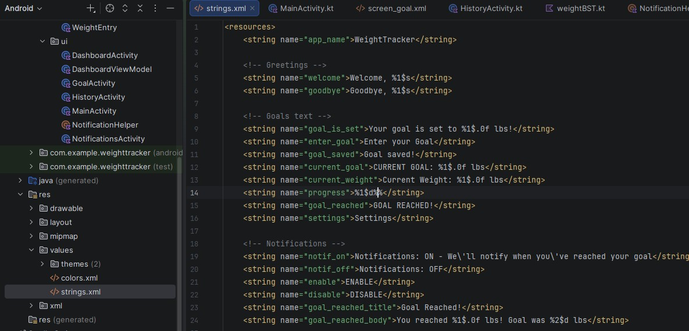
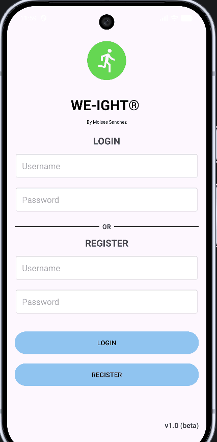
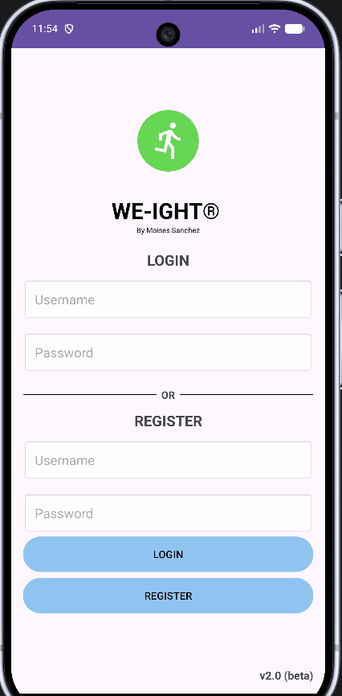

<p align="left">
  <a href="./index.html" style="display:inline-block; padding:8px 16px; background-color:#f6f8fa; color:#24292f; text-decoration:none; border-radius:6px; border:1px solid #d0d7de; font-weight:bold;">← Home</a>
</p>

<div class="note-box" style="background-color: #D6EFFF; border-left: 5px solid #2196F3; padding: 15px; margin: 10px 0;">
  <strong>Info:</strong> Built with Kotlin 1.9.22 • compileSdk 34 • minSdk 26 • targetSdk 34 • Room 2.6.1.
</div>

---
## Artifact's Origin
<p> Artifact: CS360- Final project <b>Weight Tracking App</b> <i>(Kotlin, XML, SQLite)</i><br>
Developed on August 2026 for Mobile Architecture and Programming at SNHU
</p>
<div style="text-align: justify;">
<p>
The application was developed as part of a project that required Android Studio environment. It’s original goal was to design an application that follows Android’s design foundations and best practices. The application’s core requirements were to provide CRUD operations and a trusted database, either local or online, where user data such as weight, username and passwords can be stored.
</p>
</div>
---
## Justification
<div style="text-align: justify;">
<p>The original version had correct functionality for a history screen, however the architectural layer was inefficient and did not allow scalability. On the history screen, the application retrieves the entire weight history for a user with <code class="language-plaintext highlighter-rouge">ORDER BY id</code>, then parses within the loop to segregate only five queries. The current approach uses O(n) memory time where I only need O(k) where k=5. The history will eventually compound all entries, which in returns increases load times, slows down the application and risks memory leaks. The proposed enhancement includes refactoring the memory layer to use Binary Search Tree (<b>BST</b>) via <code class="language-plaintext highlighter-rouge">TreeMap</code> as it maintains sorting by date by eliminating loop parsing and full table scans. This approach reduces computing complexity, lowering resource consumption and adding logic to detect user progress, which improves the UI and UX for long term maintainability. 
</p>
</div>
---
## Enhancement Steps
<h3><u>Refactoring storage to use BST</u></h3>
<div style="text-align: justify;">
<p>I started by creating a new package and added a <code class="language-plaintext highlighter-rouge">weightBST.kt</code> inside. The class is a wrapper around <code class="language-plaintext highlighter-rouge">TreeMap<LocalDate, WeightEntry></code> which implements a balanced BST. This new structure stores weight entries sorted by timestamps providing insertion methods, retrieving last entry and range queries. Previously, I used a linear List with O(n) that sorts and scans the entire list, this enhanced approach reduces complexity down to O(log n) operations.</p>
<br>
</div>

```kotlin
class WeightBST {
    // Binary search tree sorted by date
    private val tree = TreeMap<LocalDate, WeightEntry>()
    private val formatter = DateTimeFormatter.ofPattern("MM/dd/yyyy")

    fun insert(entry: WeightEntry) {
        val localDate = LocalDate.parse(entry.date, formatter)
        tree[localDate] = entry
    }

    fun getLastEntry(): WeightEntry? = tree.lastEntry()?.value

    fun size(): Int = tree.size
```
<p>Additionally, I added <code class="language-plaintext highlighter-rouge">getHistoryAsBST()</code> method within my existing <code class="language-plaintext highlighter-rouge">WeightRepository</code>. This method will retrieve user history from Room and will now build a <code class="language-plaintext highlighter-rouge">weightBST</code> instance. This method also uses Dispatchers.IO to maintain off-thread database access. Comparing in with the previous function that directly returned the list from DAO, this enhancement returns a sorted BST list which solves my chronological order concerns.</p>

```kotlin
private suspend fun getHistoryAsBST(username: String): WeightBST {
    return withContext(Dispatchers.IO) {
        val list = dao.getHistory(username)
        val bst = WeightBST()
        list.forEach { bst.insert(it) }
        bst
    }
}
```
<h3><u>Adding range query for retrieval efficiency</u></h3>
<p>I improved retrieval efficiency by using <code class="language-plaintext highlighter-rouge">TreeMap<LocalDate, WeightEntry></code> structure. Instead of a linear filtering O(n) over the entire list, I used <code class="language-plaintext highlighter-rouge">lastEntry()</code> to obtain the latest date in O(log n) and <code class="language-plaintext highlighter-rouge">descendingMap()</code> for the last N days. The new operation is O(log n + k) where k = the number of records return – avoiding a full scan.</p>

```kotlin
fun getLastEntry(): WeightEntry? = tree.lastEntry()?.value

fun size(): Int = tree.size

// Retrieve only last N days rather than doing a full history scan
fun getLastNDays(n: Int): List<WeightEntry> {
    if (tree.isEmpty()) return emptyList()
    // Get last N values from ordered map without full scan
    return tree.descendingMap().values.take(n).toList().reversed()
}

```
<p>The user interface will now reflect this since I added wrapper <code class="language-plaintext highlighter-rouge">getLastNDaysHistory()</code> within my <code class="language-plaintext highlighter-rouge">WeightRepository.</code></p>

```kotlin
    // Wrapper exposing range query to viewmodel
    suspend fun getLastNDaysHistory(username: String, n: Int): List<WeightEntry> {
        return withContext(Dispatchers.IO) {
            val bst = getHistoryAsBST(username)
            bst.getLastNDays(n)
        }
    }

    // Get recent weight entry via BST
    suspend fun getLastEntry(username: String): WeightEntry? {
        return withContext(Dispatchers.IO) {
            val bst = getHistoryAsBST(username)
            bst.getLastEntry()
        }
    }

    // Weight change calculation using BST structure
    suspend fun getWeightDifference(username: String): Float {
        return withContext(Dispatchers.IO) {
            getHistoryAsBST(username).getWeightDifference()
        }
    }
```

<h3><u>Updating weight calculations and modifying the notifications</u></h3>
<p>For this step, I updated the weight calculations and modifying the notifications to take advantage of the new BST structure. In my original version, both of these features relied on scanning and sorting the entire history list resulting in O(n) complexity calculations. After refactoring them to use <code class="language-plaintext highlighter-rouge">weightBST</code> methods such as <code class="language-plaintext highlighter-rouge">getLastEntry()</code>, and <code class="language-plaintext highlighter-rouge">firstEntry()</code> , I already reduced operations to O(log n + k) which ensure fast calculations and provides efficient reminder checks.
<br>
In the <code class="language-plaintext highlighter-rouge">DashboardActivity</code> module, I replaced <code class="language-plaintext highlighter-rouge">history[0]</code> to <code class="language-plaintext highlighter-rouge">history.last()</code> since getLastNDays() is now returning data that is already sorted  in the BST. </p>

```kotlin
        // History from getLastNDays sorted by BST
        currentWeight = history.last().weight
    }
    updateProgressBar()
}
```
<p>Adjusted the <code class="language-plaintext highlighter-rouge">getWeightDifference</code> to return float to match the <code class="language-plaintext highlighter-rouge">WeightEntry</code> type by adding a check that returns 0f if there are less that two entries. </p>

```kotlin
fun getWeightDifference(): Float {
    if (tree.size < 2) return 0f
    val firstWeight = tree.firstEntry()?.value?.weight?.toFloat() ?: 0f
    val lastWeight = tree.lastEntry()?.value?.weight?.toFloat() ?: 0f
    return lastWeight - firstWeight
}
```
<p>Refactored <code class="language-plaintext highlighter-rouge">showGoalReachedIfNeeded()</code> to accept <code class="language-plaintext highlighter-rouge">WeightEntry</code> instead of a list by using <code class="language-plaintext highlighter-rouge">lastEntry.Weight</code> to get the most recent weight</p>

```kotlin
// Now it takes BST instead of list for last entry check
fun showGoalReachedIfNeeded(context: Context, lastEntry: WeightEntry, goal: Int) {
    // gets current weight directly from BST
    val currentWeight = lastEntry.weight.toInt()
    // calculates progress using current and goal
    val progress = (currentWeight.toDouble() / goal * 100).toInt()
    //build notification from WeightEntry
    if (progress >= 100) {
        showGoalReached(context, goal, currentWeight)
    }
}
```
<p>Updated the load() to build the BST and reuse for the history screen and <code class="language-plaintext highlighter-rouge">getWeightDifference</code> O(log n) instead of doing two separate scans</p>

```kotlin
fun load(username: String) {
    viewModelScope.launch {

        // O(log n + k) for dashboard chart, not a full scan
        _history.value = repo.getLastNDaysHistory(username,30)

        // O(log n) for access to last entry
        _weightDiff.value = repo.getWeightDifference(username)

        _goal.value = repo.getLastTarget(username) ?: 0.0
    }
}
```

<h3><u>Updating the UI layer to display new records more efficiently</u></h3>
<p>For this step, I updated the UI layer while maintaining my original five record layout. In my initial version <code class="language-plaintext highlighter-rouge">HistoryActivity</code> relied on the <code class="language-plaintext highlighter-rouge">repository.getHistory()</code> which caused the app to load the entire history list assuming the last entry was history[0] resulting in a full scan. After refactoring to use <code class="language-plaintext highlighter-rouge">WeightBST</code> structure, I can now use <code class="language-plaintext highlighter-rouge">getLastNDays(username, 5)</code> with O(log n + k) lookup to get only those five records that I want to display. At the end, I was able to optimize the <code class="language-plaintext highlighter-rouge">refreshHistory</code> method while maintaining my original layout.</p>
<br>
  
<p>Now using BST for efficient record display and safe techniques for memory use</p>

```kotlin
private fun refreshHistory() {
    lifecycleScope.launch {
        // Build BST from Room data to display last 5 entries from current user
        val last5 = repository.getLastNDaysHistory(username, 5)
        // O(log n ) to get newest entry without scanning entire list
        val lastEntry = last5.lastOrNull()
        val lastTarget = repository.getLastTarget(username)
```

<p>O(log n) lookups gets newest entry directly from the BST via <code class="language-plaintext highlighter-rouge">getLastEntry()</code> without checking the full list.</p>

```kotlin
if (lastEntry != null) {
    currentWeight = lastEntry.weight
}
```
<h3><u>Additional features that apply Industry’s best practices</u></h3>
<p>Some other features were based on eliminating the application’s warnings from string concatenations such as <code class="language-plaintext highlighter-rouge">“Welcome, $username”</code> , since format crashes when using percentages for a Double.
<br>
By applying best practices, all the UI text has been located under my <code class="language-plaintext highlighter-rouge">strings.xml</code> by using placeholders <code class="language-plaintext highlighter-rouge">%1$s</code> and <code class="language-plaintext highlighter-rouge">%1$.0f</code> being accessed via <code class="language-plaintext highlighter-rouge">getString(R.string.welcome, username)</code> for example. This removed the <i>`SetText`</i> warnings from the environment and enable a more structured architecture.</p>

<p align="center">
  
  <br>
    <em style="color:gray;"> Figure 4: string.xml </em>
</p>
<br>
  
I removed the <code class="language-plaintext highlighter-rouge">showAddWeightDialog</code> class from the <code class="language-plaintext highlighter-rouge">HistoryActivity</code> module to have a cleaner code – making each screen handle the necessary functions without duplicating long lines of code that I had on the original artifact. Finally, I reviewed the classes from each module, along with pointers to BST sorting for history, <code class="language-plaintext highlighter-rouge">getLastEntry()</code> for O(log n) retrievals, permission for handling notifications, navigation flows and kept comments functional and brief, to ensure it explains the code properly without exposing implementation details.
</p>

---
<p align="center">
    <a href="https://github.com/Moises2121/moises2121.github.io/tree/enhancementTwoartifact/app/src/main/java/com/example/weighttracker" target="_blank">
        View my Enhancement Two Code on Github
    </a>
</p>

<div style="display:flex; justify-content:center; gap:40px; text-align:center; flex-wrap:wrap;">
  <div>
    
    <br>
    <em style="color:gray;">Figure 5: Original - History Screen</em>
  </div>

  <div>
    
    <br>
    <em style="color:gray;">Figure 6: Enhanced - History Screen</em>
  </div>
</div>

><b>Note</b>
><p>My original application allowed multiple weight entries for the same day, used O(n) lookups to search history, and allowed accidental entry deletions. Using a more structured BST and following best practices, the enhanced version offers faster load times and uses safety checks, thus handling user data securely.</p>

---
## Challenges
<div style="text-align: justify;">
<p><b>I. Unresolved reference.</b> I initially declared <code class="language-plaintext highlighter-rouge">val repository = WeightRepository</code> inside <code class="language-plaintext highlighter-rouge">onCreate</code>. Local variables such as this only exist within the function’s frame. The compiler didn't build when I tried to use <code class="language-plaintext highlighter-rouge">refreshHistory()</code> as it was out of scope.</p>

<p><b>II. Suspend function error.</b> <code class="language-plaintext highlighter-rouge">getHistoryAsBST()</code> does Room database I/O which uses <code class="language-plaintext highlighter-rouge">withContext</code>. Kotlin didn’t allow me to call from a regular function because it could freeze my UI. I mitigated this by wrapping it inside <code class="language-plaintext highlighter-rouge">lifecycleScope.launch{}</code>.</p>

<p><b>III. Import error for WeightBST.</b> The BST file was located in <i>data.local.structure.WeightBST.kt.</i> But since Kotlin doesn't auto import from other packages after refactoring. I manually added it with as <i>import com.example.weighttracker.data.local.structure.WeightBST</i>. This reinforces the importance on carefully migrating files and modules, as small details as these can cause the compiler to fail.</p>

<p><b>IV.Type mismatch error.</b> In <code class="language-plaintext highlighter-rouge">getWeightDifference() , firstEntry() , lastEntry()</code> all returned Map.Entry, not a Float. I extracted the weight .value from <code class="language-plaintext highlighter-rouge">tree.firstEntry()?.value?.weight?.toFloat() ?: 0f.</code></p>

<p><b>V. Private access error.</b> When I first added <code class="language-plaintext highlighter-rouge">getHistoryAsBST()</code> inside <code class="language-plaintext highlighter-rouge">WeightRepository</code>, I marked it as private suspend fun because it is an internal builder that converts Room <code class="language-plaintext highlighter-rouge">List<WeightEntry></WeightEntry></code> into a WeightBST. I kept <code class="language-plaintext highlighter-rouge">getHistoryAsBST()</code> private and exposed only what the UI needs through three public wrapper methods in the repository.</p>
</div>

<p><b>VI. Type mismatch.</b> In <code class="language-plaintext highlighter-rouge">NotificationHelper</code> the old call passed a List, causing a compile type mismatch because the compiler was expecting one entry but got the entire list. After refactoring, I changed the signature to accept only the newest entry to achieve O(log n) lookup.</p>

---
## Outcomes
<div style="text-align: justify;">
<p>This enhanced version of my <b>weight tracking application</b> replaces full O(n) scans of the history list with a Binary Search Tree structure using <code class="language-plaintext highlighter-rouge">TreeMap</code> and reducing operations by using <code class="language-plaintext highlighter-rouge">firstEntry/lastEntry()</code> to O(log n + k). This shows design and evalution of computing solutions while managing trade-offs between memory overhead and access time. The updated Dashboard and notification system using <code class="language-plaintext highlighter-rouge">getLastNDays()</code> to display with a single <code class="language-plaintext highlighter-rouge">WeightEntry</code> providing timely visual feedback that supports user decision-making. Keeping <code class="language-plaintext highlighter-rouge">getHistoryAsBST()</code> private, and if <code class="language-plaintext highlighter-rouge">tree.isEmpty()</code> handling enforces encapsulation and anticipates empty data exploits to protect data integrity. Documenting all compilation errors and challenges such as the unresolved references and type mismatches after refactoring, represent professional quality written communication that adapts to a technical audience.</p>
  
<p>Overall, the updated version of this artifact does not add UI elements, rather, improves the lookup complexity to ensure scalability as data grows, thus ensuring that the functionalities and user experience improve, while maintaining the original architecture of the model and continuing aligning to best practices.</p>

</div>
<br>

<hr>
<p>
  <a href="./index.html" style="display:inline-block; padding:8px 16px; background-color:#f6f8fa; color:#24292f; text-decoration:none; border-radius:6px; border:1px solid #d0d7de; font-weight:bold;">← Home</a>
  <a href="./Databases.html" style="display:inline-block; padding:8px 16px; background-color:#f6f8fa; color:#24292f; text-decoration:none; border-radius:6px; border:1px solid #d0d7de; font-weight:bold; float:right;">Next→</a>
</p>

---
### Contact:
<b>Email:</b> moises.sanchez1@snhu.edu
  <div style="margin-bottom:10px;">
    <a href="https://github.com/moises2121" target="_blank" style="text-decoration:none; display:flex; align-items:center; font-weight:600; color:#0a66c2;">
      
      Follow me on GitHub
    </a>
  </div>
  <div>
    <a href="https://www.linkedin.com/in/moises-sanchez-9ab510361/" target="_blank" style="text-decoration:none; display:flex; align-items:center; font-weight:600; color:#0a66c2;">
      
      Follow me on LinkedIn
    </a>
  </div>
  <div style="margin-top:10px;">
    <a href="https://www.youtube.com/@moisesgsg" target="_blank" style="text-decoration:none; display:flex; align-items:center; font-weight:600; color:#0a66c2;">
      
      Follow me on YouTube
    </a>
  </div>

  <!-- Darkmode.js by Sandoche - https://github.com/sandoche/Darkmode.js - MIT License -->
  <script src="https://cdn.jsdelivr.net/npm/darkmode-js@1.5.7/lib/darkmode-js.min.js"></script>
  <script>
    function addDarkmodeWidget() {
      new Darkmode({
        bottom: '32px',
        right: '32px',
        time: '0.5s',
        mixColor: '#fff',
        backgroundColor: '#fff',
        buttonColorDark: '#100f2c',
        buttonColorLight: '#fff',
        saveInCookies: true,
        label: '🌓',
        autoMatchOsTheme: true
      }).showWidget();
    }
    window.addEventListener('load', addDarkmodeWidget);
  </script>
