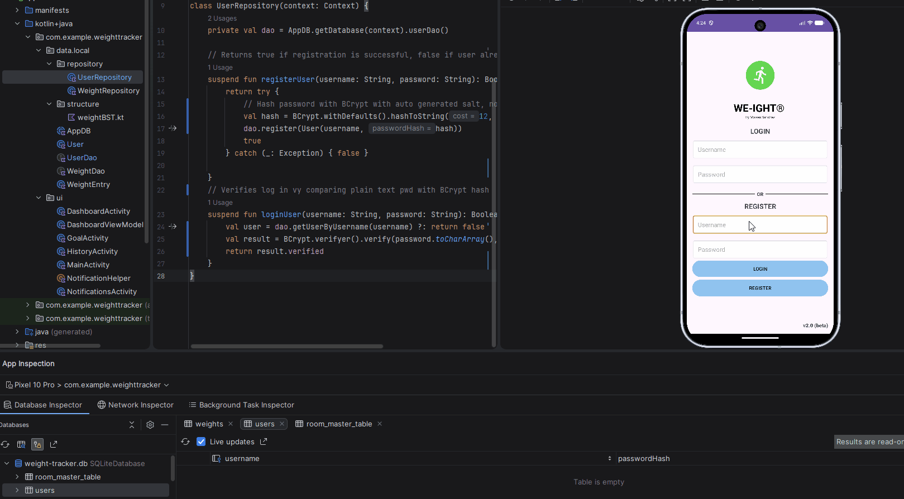
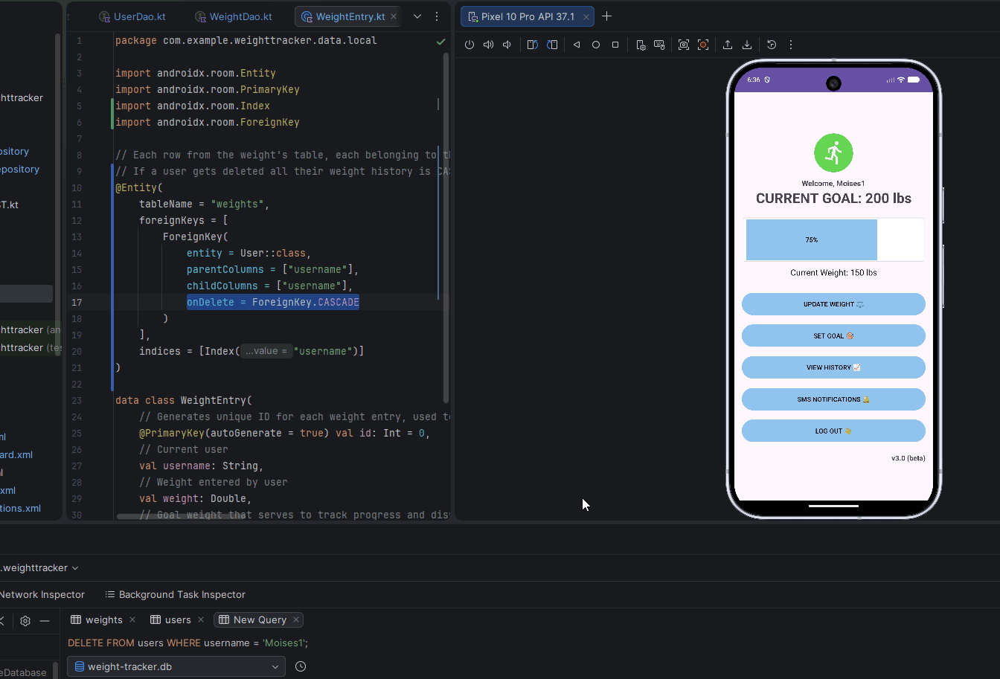
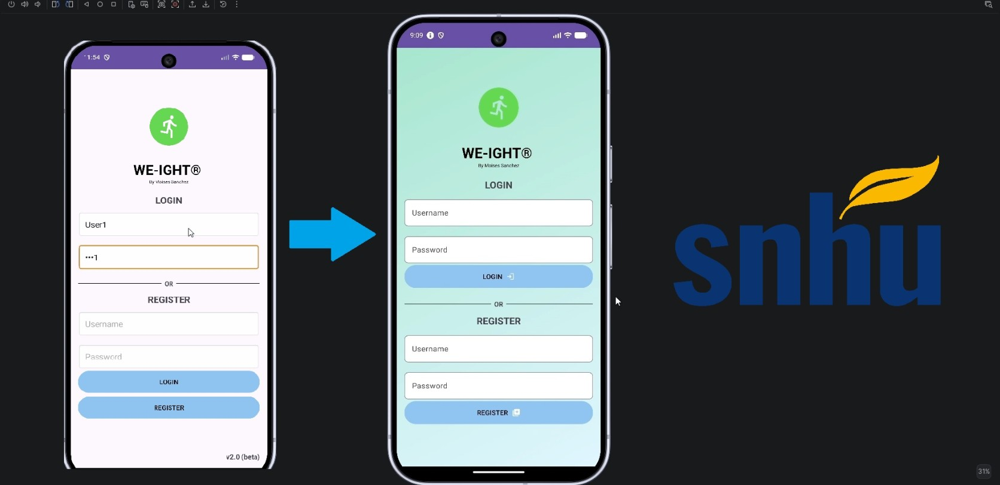

<p align="left">
  <a href="{{ '/' | relative_url }}" style="display:inline-flex; align-items:center; gap:6px; padding:8px 16px; background-color:#f6f8fa; color:#24292f; text-decoration:none; border-radius:6px; border:1px solid #d0d7de; font-weight:bold;">
    <span class="material-symbols-outlined" style="font-size:20px;">home</span> Home
  </a>
</p>

<div class="note-box" style="background-color: #D6EFFF; border-left: 5px solid #2196F3; padding: 15px; margin: 10px 0;">
  <strong>Info:</strong> Built with Kotlin 1.9.22 • compileSdk 34 • minSdk 26 • targetSdk 34 • Room 2.6.1.
</div>

---
## Artifact's Origin
<p> Artifact: CS360- Final project <b>Weight Tracking App</b> <i>(Kotlin, XML, SQLite)</i><br>
Developed on August 2026 for Mobile Architecture and Programming at SNHU
</p>
<div style="text-align: justify;">
<p>
The application was developed as part of a project that required Android Studio environment. It’s original goal was to design an application that follows Android’s design foundations and best practices. The application’s core requirements were to provide CRUD operations and a trusted database, either local or online, where user data such as weight, username and passwords can be stored.
</p>
</div>
---
## Justification
<div style="text-align: justify;">
<p>This enhancement improves my application by replacing the single SQLite from the original version that used plain text passwords, lacked foreign keys and indexes and allowed duplicate usernames. After refactoring to <code class="language-plaintext highlighter-rouge">Room</code> architecture, the application now ensures data integrity and security. The enhancement uses a natural primary key , and implements password hashing using <code class="language-plaintext highlighter-rouge">at.favre.lib:bcrypt:0.10.2</code> with <code class="language-plaintext highlighter-rouge">BCrypt.withDefaults()</code> and <code class="language-plaintext highlighter-rouge">BCrypt.verifyer()</code> for login verification. Logic fixes such as getEntryByDate enforce one entry per day without blocking the option or allowing to overflow the database. The overall structure demonstrates trade-offs between slightly more complex Room/DAO logic versus significant gain in security and relational correctness.
</p>
</div>
---
## Enhancement Steps
<h3><u>Refactoring data to normalized design using Room</u></h3>
<div style="text-align: justify;">
<p>In my previous enhancement I had already replaced the <code class="language-plaintext highlighter-rouge">SQLiteOpenHelper</code> with Room as my single source of truth. All UI modules now access data via <code class="language-plaintext highlighter-rouge">ViewModel</code> -> <code class="language-plaintext highlighter-rouge">Repository</code> -> <code class="language-plaintext highlighter-rouge">DAO</code>.
This can be found in my <code class="language-plaintext highlighter-rouge">AppDB</code> module:</p>
<br>
</div>

```kotlin
@Database(entities = [User::class, WeightEntry::class], version = 1, exportSchema = false)
abstract class AppDB : RoomDatabase() {
    // User access to user queries
    abstract fun userDao(): UserDao
    // User access to weight queries
    abstract fun weightDao(): WeightDao

```

<h3><u>Creating a users table that includes username as the Primary Key</u></h3>
<p>This step had also been performed in my previous enhancement for Software Engineering. This prevents duplicate registration, username_taken within <code class="language-plaintext highlighter-rouge">MainActivity</code> module reinforces duplicate handling:</p>

```kotlin
Toast.makeText(this@MainActivity, getString(R.string.username_taken), Toast.LENGTH_SHORT).show()

```
<p>Username set as the primary key</p>

```kotlin
// User table that handles the "Welcome, user" feature I added
@Entity(tableName = "users")
data class User(
    // Unique username set as primary key and for the welcome user feature
    @PrimaryKey val username: String,
    // Password storage for version 2 of the app
    val password: String
)
```
<p>And duplicate registration handling is found in <code class="language-plaintext highlighter-rouge">UserDao.kt</code></p>

```kotlin
// Insert new user to the database, ABORT if username already exists preventing duplicates
@Insert(onConflict = androidx.room.OnConflictStrategy.ABORT)
suspend fun register(user: User)

```

<h3><u>Implementation of password hashing</u></h3>
<p>Currently, <code class="language-plaintext highlighter-rouge">UserRepository.kt</code> and <code class="language-plaintext highlighter-rouge">UserDao.kt</code> store the password exactly as the user types in in the registration form. This vulnerability uses plain text storage, if the Room database file is extracted, all usernames and passwords are exposed – failing the security requirements for an application. By using <code class="language-plaintext highlighter-rouge">BCrypt</code>, a user’s password is never stored, instead it becomes hashed and cannot be reverted back into plain text. It also auto generates random encryption for each user even if their username is the same. Finally, at log in, the user does <code class="language-plaintext highlighter-rouge">BCrypt</code> with plain text password while it stores as hash. 
<br>
New dependencies added for password hashing:</p>

```kotlin
implementation("androidx.room:room-runtime:2.6.1")
implementation("at.favre.lib:bcrypt:0.10.2")

```
<p>Since the password will be hashed, the val passwordHash had to replace the existing val password within the User module:</p>

```kotlin
@PrimaryKey val username: String,
// Password Hashing
val passwordHash: String

```
<p>This new structure will now be querying by username rather than by password, the old method has been replaced with <code class="language-plaintext highlighter-rouge">getUserByUsername</code>:</p>

```kotlin
@Dao
interface UserDao {
    // Searches for the match username, handling null if credentials are wrong
    @Query("SELECT * FROM users WHERE username = :username LIMIT 1")
    suspend fun getUserByUsername(username: String): User?

```
<p><code class="language-plaintext highlighter-rouge">UserRepository</code> has been updated accordingly to hash passwords and verifying them against plain text from user’s login entry:</p>

```kotlin
    // Returns true if registration is successful, false if user already exists
    suspend fun registerUser(username: String, password: String): Boolean {
        return try {
            // Hash password with BCrypt with auto generated salt, not reversible
            val hash = BCrypt.withDefaults().hashToString(12, password.toCharArray())
            dao.register(User(username, hash))
            true
        } catch (_: Exception) { false }

    }
    // Verifies log in vy comparing plain text pwd with BCrypt hash
    suspend fun loginUser(username: String, password: String): Boolean {
        val user = dao.getUserByUsername(username) ?: return false
        val result = BCrypt.verifyer().verify(password.toCharArray(), user.passwordHash)
        return result.verified
    }
}
```
<p>Passwords are now stored as <code class="language-plaintext highlighter-rouge">BCrypt</code> hashes with salt (one-way) instead of plain text, the following image shows the result:</p>

<p align="center">
  
  <br>
    <em style="color:gray;"> Figure 7: Passwords stored as BCrypt Hash </em>
</p>

><b>Note</b>
><p>The artifact exposed user's passwords. This enhancement prevents reverse hashing so the application can securely store passwords without compromising user's personal data.</p>

<h3><u>Creating a weight table using <code class="language-plaintext highlighter-rouge">ForeignKey</code></u></h3>
<p>The app now reinforces integrity between users and weights, so that every weight entry belongs to an existing user and deleting a user from the database will also delete their history. <code class="language-plaintext highlighter-rouge">ForeignKey with CASCADE</code> and index on username.</p>
<br>
  
<p>Parent table:</p>

```kotlin
@Entity(tableName = "users")
data class User(
    // Unique username set as primary key and for the welcome user feature
    @PrimaryKey val username: String,
    // Password Hashing
    val passwordHash: String,
    // Weight Goal
    val goalWeight: Double = 0.0
)
```

<p>Child table:</p>

```kotlin
@Entity(
    tableName = "weights",
    foreignKeys = [
        ForeignKey(
            entity = User::class,
            parentColumns = ["username"],
            childColumns = ["username"],
            onDelete = ForeignKey.CASCADE
        )
    ],
    indices = [Index("username")]
)

data class WeightEntry(
    // Generates unique ID for each weight entry, used to identify records to delete
    @PrimaryKey(autoGenerate = true) val id: Int = 0,
    // Current user
    val username: String,
    // Weight entered by user
    val weight: Double,
    // Goal weight that serves to track progress and display history
    val goalWeight: Double,
    // Generate the date for the entry, used to be displayed in history
    val date: String = java.text.SimpleDateFormat("MM/dd/yyyy", java.util.Locale.US).format(java.util.Date())
)

```
<p>Updated database at version 3:</p>

```kotlin
@Database(entities = [User::class, WeightEntry::class], version = 3, exportSchema = false)
abstract class AppDB : RoomDatabase() {
    // User access to user queries
    abstract fun userDao(): UserDao
    // User access to weight queries
    abstract fun weightDao(): WeightDao

    // With companion object we only use a single db instance for the application
    companion object {
        // All instances are up to date
        @Volatile
        private var INSTANCE: AppDB? = null

        // Retrieves database instance, and creates a db file if it doesn't exist yet
        fun getDatabase(context: Context): AppDB {
            return INSTANCE ?: synchronized(this) {
                val instance = Room.databaseBuilder(
                    context.applicationContext,
                    AppDB::class.java,
                    "weight-tracker.db"
                // Destroys old db and recreates with Foreign Key
                ).fallbackToDestructiveMigration().build()
                INSTANCE = instance
                instance
            }
        }
    }
}

```
<p align="center">
  
  <br>
    <em style="color:gray;"> Figure 8: Deleting a username via ForeignKey </em>
</p>
<br>

<h3><u>Additional features that apply Industry’s best practices</u></h3>
<p>UI enhancements were added in to improve the overall presentation of this enhanced artifact, including using android and google icons for app compatibility, and gradient background for a more presentable look.</p>
<br>

<p align="center">
  <a href="https://youtu.be/pI6mpolqfNA?si=C_DfGjL5LwqpLZpT" target="_blank">
    Checkout the enhanced artifact on Youtube !
    
  </a>
</p>

---
<p align="center">
    <a href="https://github.com/Moises2121/moises2121.github.io/tree/enhancementThreeartifact/app/src/main/java/com/example/weighttracker" target="_blank">
        View my Enhancement Three Code on Github
    </a>
</p>


---
## Challenges
<div style="text-align: normal;">
<p><b>I. Goal Reach Notification.</b> Even if progress was at 60%, the notification was called because current was bigger than goal , also showing every time I opened home. I adjusted the logic to trigger after a new weight is saved and check if progress == 100%, and avoided showing notification if the goal <= 0 on screen load. </p>

<p><b>II. Foreign Key crash.</b> When adding a ForeignKey to <code class="language-plaintext highlighter-rouge">weightEntry</code>, the app froze and failed when inserting before login or with an empty username. I made sure to pass the logged in username from <code class="language-plaintext highlighter-rouge">SharedPreferences</code> and added a <code class="language-plaintext highlighter-rouge">withContext</code> and null-check before checking if the goal has been reached.</p>

<p><b>III. History showing 0.0. </b> When I set an initial goal I was inserting <code class="language-plaintext highlighter-rouge">WeightEntry = 0.0</code> as default, thus showing 0.0 and not allowing me to adjust unless the entry was deleted. By creating a new Dao method to <code class="language-plaintext highlighter-rouge">updateAllGoals()</code> that only does update weights without insert and adding a setGoal() in the viewmodel helped eliminate this vulnerability.</p>

<p><b>IV.History not showing all results.</b> getAllEntries returned all rows from DB not filtered by user. I mitigated this by using queries where username =:username and used <code class="language-plaintext highlighter-rouge">dao.getEntriesForUser(username)</code> plus LiveData reload, proving Foreign Key implementation was successful.</p>

<p><b>V. App crash on inserting new weight.</b> After adding multiple weighs for the same day, history got conflicted. I initially had this resolved but after refactoring the code for this enhancement I encountered this issue again. I added a <code class="language-plaintext highlighter-rouge">getEntryByDate(username, today)</code> check, therefore, if a user adds multiple weights in a day, in will overwrite existing weight rather than blocking the option or adding it to the database.</p>
</div>

---
## Outcomes
<div style="text-align: justify;">
<p>This enhancement implements a normalized database using Room with a primary key(id), foreign key(username referencing user table) and indexed queries, ensuring data integrity and improves performance by preventing full scan and duplicate rows. It also implements security best practices by hashing passwords with <code class="language-plaintext highlighter-rouge">BCrypt</code> before storage and enforce foreign fey constraints to prevent unauthorized access. I also evaluate databases solutions by  demonstrating the use of industry tools such as Room, DAO and SQLite and protecting user information prior to deployment, overall ensuring passwords don’t get stored in plain text and that each weight record is associated to a user.</p>
  
<p>Overall, the updated version of this artifact prevents data extraction by using <code class="language-plaintext highlighter-rouge">BCrypt</code> hashing, prevents crashes by allowing the user to modify current weight data, maintains previous enhancements, and upgrades the User Interface to follow Android's best practices.</p>

</div>
<br>

<hr>
<p align="left">
  <a href="{{ '/' | relative_url }}" style="display:inline-flex; align-items:center; gap:6px; padding:8px 16px; background-color:#f6f8fa; color:#24292f; text-decoration:none; border-radius:6px; border:1px solid #d0d7de; font-weight:bold;">
    <span class="material-symbols-outlined" style="font-size:20px;">home</span> Home
  </a>
</p>
---
  

  
