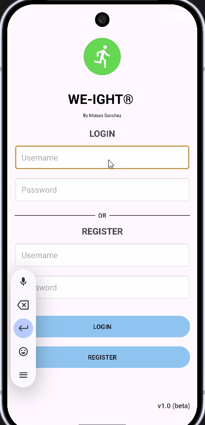
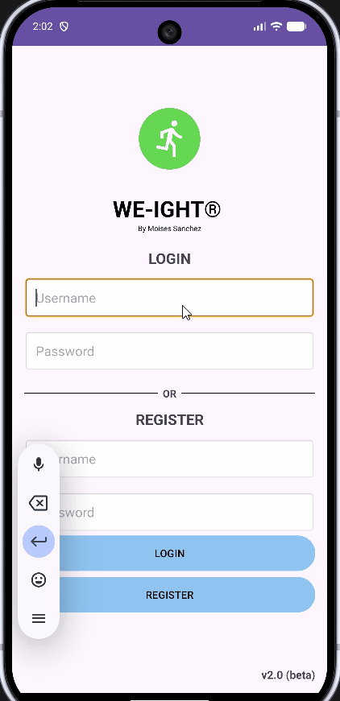

<p align="left">
  <a href="./index.html" style="display:inline-block; padding:8px 16px; background-color:#f6f8fa; color:#24292f; text-decoration:none; border-radius:6px; border:1px solid #d0d7de; font-weight:bold;">← Home</a>
</p>

> <b>Build Info</b>
> <p>Built with Kotlin 1.9.22 • compileSdk 34 • minSdk 26 • targetSdk 34 • Room 2.6.1</p>

---
## Artifact's Origin
<p> Artifact: CS360- Final project <b>Weight Tracking App</b> <i>(Kotlin, XML, SQLite)</i><br>
Developed on August 2026 for Mobile Architecture and Programming at SNHU
</p>
<div style="text-align: justify;">
<p>
The application was developed as part of a project that required Android Studio environment. It’s original goal was to design an application that follows Android’s design foundations and best practices. The application’s core requirements were to provide CRUD operations and a trusted database, either local or online, where user data such as weight, username and passwords can be stored.
</p>
</div>
---
## Justification
<div style="text-align: justify;">
<p>The original version of this submission implemented an unstructured SQLite helper that verifies the user’s authentications but violates single responsibility principle. The DashboardActivity module handles most of the operations for the application’s functionalities and hardcoded <i>test</i> username breaks the multi-user support, which does not follow best practices.
In the initial version of this artifact, the CRUD operations don't work properly without causing memory leaks, or accidentally exposing another user’s personal data. The modules don’t follow a structured architecture that can be used for improvements. Therefore, the enhancement includes refactoring the tree’s architecture in a professional manner, as well as adding accurate documentation with in-line comments to improve the application’s sustainability and readability. 
</p>
</div>
---
## Enhancement Steps
<h3><u>Fixing the data layer by updating DAO queries</u></h3>
<div style="text-align: justify;">
<p>The data layer needed to be corrected first. By creating data/local package and implementing WeightEntry as the entity, WeightDao for SQL queries, AppDB for the database, I established a great foundation. Introducing WeightRepository and UserRepository as the single source of truth the UI of the application already improved as it was easier to maintain with a clear separation of my concerns for the data layer:</p>
<br>
</div>
<p align="center">
  
  <br>
    <em style="color:gray;"> Figure 1: Updated DAO structure </em>
</p>
<br>
<p>WeightDao is now the only place that handles SQL, which enforce my separation concerns. Aditionally, the ViewModel no longer executes queries directly:</p>

```kotlin
@Dao
interface WeightDao {
    // Reads current user's weight history ordered newest to oldest
    @Query("SELECT * FROM weights WHERE username = :username ORDER BY id DESC")
    suspend fun getHistory(username: String): List<WeightEntry>

    // Deletes the weight selected by the current user using the weight's ID
    @Query("DELETE FROM weights WHERE id = :id")
    suspend fun deleteWeight(id: Int)

    // Creates (Inserts) new weight into the database
    @Insert
    suspend fun insert(entry: WeightEntry)

    // Gets latest goal weight from current user
    @Query("SELECT goalWeight FROM weights WHERE username = :username ORDER BY id DESC LIMIT 1")
    suspend fun getLastTarget(username: String): Double?
}
```
<p>No more harcoded <i>test</i> username, UserRepository has login and register and carry USERNAME via intent , so now each DAO query can filter by real username. Previously, the username was harcoded so the current’s user information was not carried between screens via Intent. This fix enforces user isolation and multi-user functionality, where the application now sees the real session rather than the generic test user:</p>

```kotlin
class DashboardActivity : AppCompatActivity() {

    private lateinit var username: String
    private var currentWeight = 180.0
    private var goalWeight = 220.0
    private lateinit var viewModel: DashboardViewModel

    override fun onCreate(savedInstanceState: Bundle?) {
        super.onCreate(savedInstanceState)
        setContentView(R.layout.screen_dashboard)

        // Gets username from login
        username = intent.getStringExtra("USERNAME")?: run {
            Toast.makeText(this, "Please login", Toast.LENGTH_SHORT).show()
            startActivity(Intent(this, MainActivity::class.java))
            finish()
            return
        }

        // Personalized greeting at the top to display current user
        findViewById<TextView>(R.id.tvWelcome).text = "Welcome, $username"

        val repository = WeightRepository(applicationContext)
```
<h3><u>Creating a source of truth by creating a WeightRepository class</u></h3>
<p>The first release of the application did not have a repository, therefore Activities called DatabaseHelper directly. There was no single place where all data was securely stored. By adding a WeightRepository as the single source of truth, both the viewmodel and UI don’t know where the data comes from, instead they just ask the repository.</p>

```kotlin
class WeightRepository(context: Context) {
    private val dao = AppDB.getDatabase(context).weightDao()

    // Gets full history of current user
    suspend fun getHistory(username: String): List<WeightEntry> {
        return withContext(Dispatchers.IO) {
            dao.getHistory(username)
        }
    }

    // Gets latest saved goal
    suspend fun getLastTarget(username: String): Double? {
        return withContext(Dispatchers.IO) {
            dao.getLastTarget(username)
        }
    }

    // Deletes single weight entry by ID
    suspend fun deleteWeight(id: Int) {
        withContext(Dispatchers.IO) {
            dao.deleteWeight(id)
        }
    }

    // Creates new weight entry for logged-in user
    suspend fun addWeight(username: String, weight: Double, goal: Double) {
        withContext(Dispatchers.IO) {
            dao.insert(WeightEntry(username = username, weight = weight, goalWeight = goal))
        }
    }
}
```
<h3><u>Fixing the ViewModel layer</u></h3>
<p>I did not have a viewmodel layer on my first release, therefore all states of current weight and goal weights resided within the Activity modules, and if the screen was rotated the information got cleared. By adding a DashboardViewModel module, the state is held regardless of screen rotation with LiveData.</p>

```kotlin
class DashboardViewModel(private val repo: WeightRepository) : ViewModel() {
    private val _history = MutableLiveData<List<WeightEntry>>()
    // Read only version visible for the User Interface to display progress bar
    val history: LiveData<List<WeightEntry>> = _history
    // Holds goal to prefill the input field
    private val _goal = MutableLiveData<Double>()
    val goal: LiveData<Double> = _goal

    // Load user's data by fetching their history and goal (For version 2.0 the default is 220.0)
    fun load(username: String) {
        viewModelScope.launch {
            _history.value = repo.getHistory(username)
            _goal.value = repo.getLastTarget(username) ?: 220.0
        }
    }

    // Saves weight entry and reloads the data so the progress bar gets updated
    fun addWeight(username: String, weight: Double, goal: Double) {
        viewModelScope.launch {
            repo.addWeight(username, weight, goal)
            load(username)
        }
    }
}
```
<h3><u>Updating the UI layer by refactoring the activities dashboard</u></h3>
<p>DashboardActivity module opened the database, queried the history as <i>O of n</i> (everything), calculated the user’s progress and updated the TextViews. This violated single responsibility principle as it had multiple functions with mixed data and UI logic. After the enhancement, DashboardActivity is now only responsible for observing the ViewModel and rendering the progress bar. </p>

```kotlin
        // Sets up viewmodel which handles the data logic
        viewModel = ViewModelProvider(this, object : ViewModelProvider.Factory {
            @Suppress("UNCHECKED_CAST")
            override fun <T : ViewModel> create(modelClass: Class<T>): T {
                return DashboardViewModel(repository) as T
            }
        })[DashboardViewModel::class.java]

        // Once history changes, the current weight and progress bar get updated
        viewModel.history.observe(this) { history ->
            if (history.isNotEmpty()) {
                currentWeight = history[0].weight
            }
            updateProgressBar()
        }

        // Once goal changes, the progress bar gets updated
        viewModel.goal.observe(this) { savedGoal ->
            goalWeight = savedGoal
            updateProgressBar()
        }
```
---
<p align="center">
    <a href="https://github.com/Moises2121/moises2121.github.io/tree/enhancementOneartifact/app/src/main/java/com/example/weighttracker" target="_blank">
        View my Enhancement One Code on Github
    </a>
</p>

<div style="display:flex; justify-content:center; gap:40px; text-align:center; flex-wrap:wrap;">
  <div>
    
    <br>
    <em style="color:gray;">Figure 2: Original - Login / Registration</em>
  </div>

  <div>
    
    <br>
    <em style="color:gray;">Figure 3: Enhanced - Login / Registration</em>
  </div>
</div>

><b>Note</b>
><p>My original application relied on harcoded <i>test</i> displaying the same data for all users. The enhanced version uses Room database with DAO to effectively show the current user's weight data.</p>

---
## Challenges
<div style="text-align: justify;">
<p><b>I. Unknown references.</b> Some challenges included manifest errors when migrating all the activities modules to the ui folder. Android could not find the references at first because the mapping was modified. To mitigate this, I renamed the modules in manifest and fixed the imports in the Kotlin files.</p>

<p><b>II. Exception errors.</b> I added a “Welcome, <i>User</i>” on every screen, however the build started failing with a <i>NullPointerException</i> at parseDebugLocalResources. After further debugging, found out that I had some illegal folders inside my mipmap. Deleting the entire folder and creating a new one via New then Image Asset created the correct mipmap-hdpi.</p>

<p><b>III. Syntax errors.</b> Some errors were encountered such as forgetting pointers and semicolons in this Kotlin logic, such as incorrect layout_height values that should have been wrap_content instead, and missing attributes such as contentDescription for accessibility.</p>

<p><b>IV. Nulls and crashes.</b> I had the harcoded <i>test</i> username in version 1.0 of this application to test against the database. Once I removed it, I forgot to pass the USERNAME extra on all my navigations, therefore, intent.getStringExtra(“USERNAME”) returned null. After tracing back to the intent, I added the username to every intent that opens another screen, with a null check with <i>finish()</i> at the beginning of onCreate. At the end, the history screen stopped crashing and I was able to see the correct loaded data by unique username.</p>

<p><b>V. Adding more modules.</b> The first version was simple and effective, but not functional for a full-stack application. I was challenged to untangle old database calls and wiring new dependencies. I mitigated this by working one step at a time, structure migrating and verifying each screen loads correctly. This helped me strengthen my abilities to deliver proper separation, test and align with industry standards.</p>
</div>
---
## Outcomes
<div style="text-align: justify;">
<p>I am confident that the outcomes came out as expected. The enhanced version will now evaluate computing solutions and manage trade-offs between architectural layers, by demonstrating abilities to use skills and tools for the purpose of implementing a solution to accomplish industry goals. It also implements industry tools such as Room, LiveData and repository to build a maintainable architecture, outlining the outcome on delivering a professional and coherent application to our weight tracking audience. Finally, it fixes collaborative failures where a different user might see the first user’s personal data due to having <i>test</i> user hardcoded in the application, which mitigates design flaws and ensures privacy and enhanced security of personal data.</p>
  
<p>Overall, this enhancement helped the functionality and reliability of the application’s usage. It does not break the overall architecture and core requirements, it simply improves the areas that needed more coverage from the first release.</p>

</div>
<br>

<hr>
<p>
  <a href="./index.html" style="display:inline-block; padding:8px 16px; background-color:#f6f8fa; color:#24292f; text-decoration:none; border-radius:6px; border:1px solid #d0d7de; font-weight:bold;">← Home</a>
  <a href="./Algorithms.html" style="display:inline-block; padding:8px 16px; background-color:#f6f8fa; color:#24292f; text-decoration:none; border-radius:6px; border:1px solid #d0d7de; font-weight:bold; float:right;">Next→</a>
</p>

---
### Contact:
<b>Email:</b> moises.sanchez1@snhu.edu
  <div style="margin-bottom:10px;">
    <a href="https://github.com/moises2121" target="_blank" style="text-decoration:none; display:flex; align-items:center; font-weight:600; color:#0a66c2;">
      
      Follow me on GitHub
    </a>
  </div>
  <div>
    <a href="https://www.linkedin.com/in/moises-sanchez-9ab510361/" target="_blank" style="text-decoration:none; display:flex; align-items:center; font-weight:600; color:#0a66c2;">
      
      Follow me on LinkedIn
    </a>
  </div>
  <div style="margin-top:10px;">
    <a href="https://www.youtube.com/@moisesgsg" target="_blank" style="text-decoration:none; display:flex; align-items:center; font-weight:600; color:#0a66c2;">
      
      Follow me on YouTube
    </a>
  </div>
