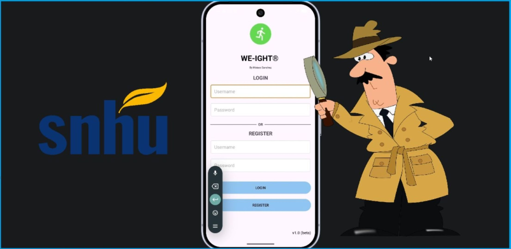

  
  

## Introduction

  

Welcome to my CS499 ePortfolio. Here I showcase my skills obtained throught the BS in CS degree in a professional and descriptive manner, along with mitgation steps for challenges encountered. More specifically, I will discuss and review improved elements for the enhancement of my weight tracking application.
The main goal is building a reliable and maintainable application with a professional architecture foundation that follows industry's best practices. This page will include a self assesment, video code review and the before and after artifact with its respective narratives.
  

## Self Assesment

  

Under development...
  

## Overview

  

First, I deliver code review for the artifact. This video outlines the current structure of the application and its services, then it shows the functionality of each module. In this code review, the areas of weaknesses are pointed out, using a developer's checklist for best practices. Then, the three enhancements will be discussed along with the steps that I must take in order to fulfill the enhanced version. At the end, this strategy gives us (developers) an opportunity to find vulnerabilites before launching the final product.

  

    <a href="https://youtu.be/efCo_He-T5c" target="_blank">
        Watch my initial code review
    </a>

### Software Design & Engineering
Under construction...

  <a href="SoftwareEngineering.md" class="btn">Enhancement 1</a>

### Algorithms & Data Structures
Under construction...

### Databases
Under construction...

## Contact:
moises.sanchez1@snhu.edu
