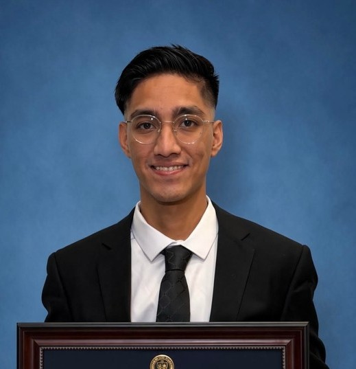

  

## Introduction
Welcome to my CS499 ePortfolio. Here I showcase my skills obtained throught the BS in CS degree in a professional and descriptive manner, along with the obstacles encountered and the steps taken to remediate them. More specifically, discuss and review improved artifacts for the enhancement of a weight tracking application.

### Software Design & Engineering
Under construction...

### Algorithms & Data Structures
Under construction...

### Databases
Under construction...

## Contact:
moises.sanchez1@snhu.edu
