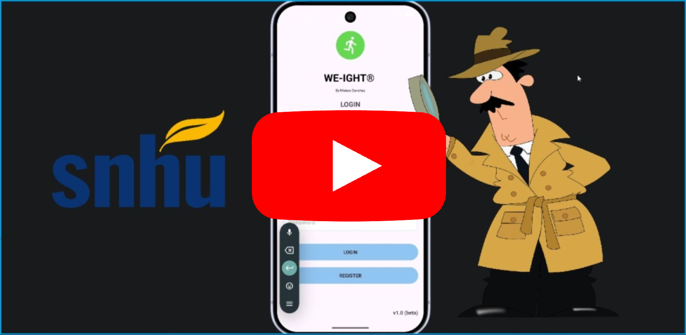

  
  

---
## Introduction

  

Welcome to my CS499 ePortfolio. Here, I showcase my skills obtained throught the BS in CS degree in a professional and descriptive manner, along with mitgation steps for the challenges encountered. I will discuss and review improved elements for the enhancement of my <b>Weight Tracking Application</b>.
I’m aiming to develop a fully functional application that follows best practices and enhances user experience, as well as ensuring database is properly handled. More specifically, ensuring the code is readable and sustainable, the UI and UX elements are adequate for the desired audience and using ROOM to handle database components. This page will include a self assesment, video code review and the before and after artifact with its respective narratives.
  

---

## Table of Contents
* TOC
{:toc}

---
## Self Assesment

  

<i>Under construction (Completion ETA 10.16.26)...</i>
  

---
## Code Review

  

First, my developer's code review. This video outlines the current structure of the application and its services, then it shows the functionality of each module. In this code review, the areas of weaknesses are pointed out, using a developer's checklist for best practices. Then, the three enhancements will be discussed along with the steps that I must take in order to fulfill the enhanced version. At the end, this strategy gives us (developers) an opportunity to find vulnerabilites before launching the final product.

  

  <h4 style="margin:6px;">
    <a href="CodeReview_transcript.srt" download> Click Here to Download the Video Transcript </a>
  </h4>
  <h4 style="margin:6px;">
    <a href="https://github.com/Moises2121/moises2121.github.io/tree/originalartifact/app/src/main/java/com/example/weighttracker" target="_blank"> See Original Code (version 1.0) </a>
  </h4>

      
 

  

As seen in the code review, the main areas of focus are the structural architecture of the application, adding repositories for weight and users, using a binary search tree (BST) for <i>O log n</i> lookups, refactoring via ROOM, using foreign keys to handle databases, and adding professional commenting styles that allow reusability and readability practices.
 
I will use my skills in Software Design & Engineering, Algorithms & Data Structures and Databases to articulate best practices and deliver a professional refactored artifact. Feel free to read through each category's narratives, challenges as well as the artifact's before and after status.

---
## Software Design & Engineering

The first version of my <b>Weight Tracking Application</b> contains severe security concerns that must be addressed prior to production release. While it was a great project for the Mobile Architecture course, it lacked multi-user functionality and fundamentals of a more complex data-layer. I did not have enough time to cover those vulnerabilites during that course, however, after continuing my student career at SNHU, I was able to identify and mitigate these issues.

  <a href="./SoftwareEngineering.html" style="display:inline-block; padding:10px 20px; background-color:#238636; color:white; text-decoration:none; border-radius:6px; font-weight:bold;">Go to Enhancement One</a>

---
## Algorithms & Data Structures

<i>Under construction (Completion ETA 09.27.26)...</i>

  <a href="./Algorithms.html" style="display:inline-block; padding:10px 20px; background-color:#238636; color:white; text-decoration:none; border-radius:6px; font-weight:bold;">Go to Enhancement Two</a>

---
## Databases

<i>Under construction (Completion ETA 10.04.26)...</i>

  <a href="./Databases.html" style="display:inline-block; padding:10px 20px; background-color:#238636; color:white; text-decoration:none; border-radius:6px; font-weight:bold;">Go to Enhancement Three</a>

---
### Contact:
<b>Email:</b> moises.sanchez1@snhu.edu
  

    <a href="https://github.com/moises2121" target="_blank" style="text-decoration:none; display:flex; align-items:center; font-weight:600; color:#0a66c2;">
      
      Follow me on GitHub
    </a>
  

  

    <a href="https://www.linkedin.com/in/moises-sanchez-9ab510361/" target="_blank" style="text-decoration:none; display:flex; align-items:center; font-weight:600; color:#0a66c2;">
      
      Follow me on LinkedIn
    </a>
  

