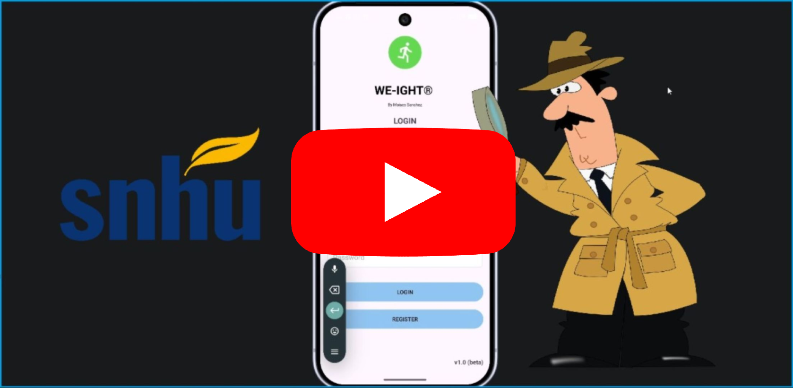

---
---

  
  

---

|

---
## Introduction

  

Welcome to my CS499 ePortfolio. Here, I showcase my skills obtained throught the BS in CS degree in a professional and descriptive manner, along with mitigation steps for the challenges encountered. I will discuss and review improved elements for the enhancement of my <b>Weight Tracking Application</b>.
I’m aiming to develop a fully functional application that follows best practices and enhances user experience, as well as ensuring database is properly handled. More specifically, ensuring the code is readable and sustainable, the UI and UX elements are adequate for the desired audience and using Room library for Android to handle database components. This page will include a self assesment, video code review, and the before and after artifact for each enhancement- each containing a descriptive narrative.
  

---

## Table of Contents
* TOC
* 
{:toc}

---
## Self Assesment

  

<i>Under construction (Completion ETA 10.16.26)...</i>
  

---
## Code Review

  

First, my developer's code review. This video outlines the current structure of the application and its services, then it shows the functionality of each module. In this code review, the areas of weaknesses are pointed out, using a developer's <a href="Assets/Developer_Checklist.pdf" target="_blank">checklist</a> for best practices. Then, the three enhancements will be discussed along with the steps that I must take in order to fulfill the enhanced version. At the end, this strategy gives us (developers) an opportunity to find vulnerabilites before launching the final product.

  

  <h4 style="margin:6px;">
    <a href="Assets/CodeReview_transcript.srt" download id="downloadBtn" style="display:inline-flex; align-items:center; gap:6px; justify-content:center; text-decoration:none;">
      link
      Download the Video Transcript
    </a>
    
    
  </h4>
  <h4 style="margin:6px;">
   <a href="https://github.com/Moises2121/moises2121.github.io/tree/originalartifact/app/src/main/java/com/example/weighttracker" target="_blank" style="display:inline-flex; align-items:center; gap:6px; justify-content:center; text-decoration:none;">
      link
      See Original Code (First version)
    </a>
  </h4>

      
 

  

As seen in the code review, the main areas of focus are the structural architecture of the application, adding repositories for weight and users, using a binary search tree (BST) for <i>O log n</i> lookups, refactoring via <code class="language-plaintext highlighter-rouge">Room</code>, using foreign keys to handle databases, and adding professional commenting styles that allow reusability and readability practices.
 
I will use my skills in Software Design & Engineering, Algorithms & Data Structures and Databases to articulate best practices and deliver a professional refactored artifact. Feel free to read through each category's narratives, challenges as well as the artifact's before and after status.

---
## engineering Software Design & Engineering

The first version of my <b>Weight Tracking Application</b> contains severe security concerns that must be addressed prior to production release. While it was a great project for the Mobile Architecture course, it lacked multi-user functionality and fundamentals of a more complex data-layer. I did not have enough time to cover those vulnerabilites during that course, however, after continuing my student career at SNHU, I was able to identify and mitigate these issues.

  <a href="./SoftwareEngineering.html" style="display:inline-block; padding:10px 20px; background-color:#238636; color:white; text-decoration:none; border-radius:6px; font-weight:bold;">Go to Enhancement One</a>

---
## account_tree Algorithms & Data Structures

Initially, I developed the application using an arrayList that scans the entire weights database to collect the latest five entries. While it was good for an initial application, it's important to keep in mind the audience and collected data can grow over time. I apply techniques learned from CS300 to implement a binary search tree (BST) that supports faster lookups, improving peformance and allowing scalability.

  <a href="./Algorithms.html" style="display:inline-block; padding:10px 20px; background-color:#238636; color:white; text-decoration:none; border-radius:6px; font-weight:bold;">Go to Enhancement Two</a>

---
## database Databases

The first release was functional but stored plain text passwords within the database, risking user privacy. For this Databases enhancement, the database layer is strenghtened by storing user passwords as BCrypt hashes that help prevent credential leaks, and an additional reinforcement is using ForeignKey with onDelete CASCADE so that if a user is deleted, all their personal data including weight entries are removed from the records, thus preventing dangling data.

  <a href="./Databases.html" style="display:inline-block; padding:10px 20px; background-color:#238636; color:white; text-decoration:none; border-radius:6px; font-weight:bold;">Go to Enhancement Three</a>

---
  
  
  
  
  
